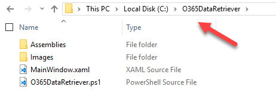
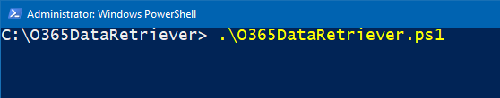
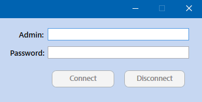

# O365 Data Retriever

## Summary
The tool will extract some data from Office 365 by using PowerShell cmdlets in the background.

At this point in time, the tool **will likely not be suitable** for large tenants.  
The retrieval and display of the data may take longer than expected, but improving the performance is a top priority! We're working on it!


## Pre-requisites

The tool is using / needs the following to run successfully.

### Modules
* [Microsoft Azure AD Module for Windows PowerShell](https://docs.microsoft.com/en-us/office365/enterprise/powershell/connect-to-office-365-powershell#connect-with-the-microsoft-azure-active-directory-module-for-windows-powershell) _(Msol cmdlets)_  
_Right now, we are _**not**_ using the [Azure AD PowerShell for Graph](https://docs.microsoft.com/en-gb/powershell/azure/active-directory/install-adv2?view=azureadps-2.0) module, but we will gradualy make the transition to the AzureAD cmdlets, and this will be communicated in due course._
* [Microsoft Online Services Sign-In Assistant](https://www.microsoft.com/en-us/download/details.aspx?id=41950)
* [SharePoint Online Management Shell](https://www.microsoft.com/en-us/download/details.aspx?id=35588) module  
_We are **not** currently using SharePoint PowerShell PnP, but that will be coming soon to enhance the tool!_
* [Skype for Business Online](https://www.microsoft.com/en-us/download/details.aspx?id=39366) module
* [Microsoft Teams](https://www.powershellgallery.com/packages/MicrosoftTeams/) module


### Permissions
* The tool should be used by Office 365 _**Global Admins**_ for release 0.1.0.  
_Further enhancements will surely make it available for other admins (EXO, SPO, etc...), and this will be communicated in due time._

* The _Execution Policy_ must be set to **"Unrestricted"** for release 0.1.0.  
_This is an important subject, and if you are not able to change the policy for security reasons, we completely understand. We will work on it as soon as possible._

* Skype for Business Online **will** require the _**WinRM service**_ to be started. Therefore, the tool _will attempt_ to start this service if it's not.

* Multi-Factor Authentication _(MFA)_ is **not** yet supported in this first release 0.1.0, but actively working on it.


### Software
This tool has only been tested on Windows 10 at the time of release 0.1.0.  
If you use PowerShell regularly to manage your Office 365 tenant, then you should be good to go. If not, have a look at the [common issues](https://docs.microsoft.com/en-us/office365/enterprise/powershell/connect-to-office-365-powershell#how-do-you-know-this-worked).


## Which files do I need for the tool to work?

For the tool to run correctly, you need the following:

* **Assemblies** folder  
_This folder contains all the .dll necessary for the tool_

* **Images** folder  
_This folder contains a few images used in the tool_

* **MainWindow.xaml** file  
_This file contains all the elements for the graphical part_

* **O365DataRetriever.ps1** file  
_This file contains the PowerShell script with bindings to the xaml file_


## How do I launch the tool?
Please note that for simplicity, the tool should be installed on the C:\ drive.  
However, if you wish to change the location, the XAML & PS1 files should be updated to reference your own location.

1. Create a folder named "O365DataRetriever" at the root of your C:\ drive, and add the 2 folders + 2 files _(see above)_  
_The **MainWindow.xaml** file and the **O365DataRetriever.ps1** file are both referencing this location. If you don't want the tool to be on your C: drive, change the path to your new one in both files._




2. Open a PowerShell window _(console or ISE)_ with admin rights, and navigate to the location of the main folder containing all the files/folders.

3. Launch the tool by running ```.\O365DataRetriever.ps1```



4. Once the tool is visible, on the top right corner, enter your O365 Global Admin account + password, then click on "Connect" _(or press "Enter" on your keyboard)_



5. Wait for a few seconds to _retrieve_ and _display_ the data.


## Having issues with the instructions?
Please go to the [Report Issues](https://github.com/VeronicaGeek/O365-Data-Retriever-Tool/issues) page, or use the [@veronicageek](https://twitter.com/veronicageek) / [@O365DataR](https://twitter.com/O365DataR) accounts on Twitter for the time being.

 _**Remember though, always be respectful please.**_
 